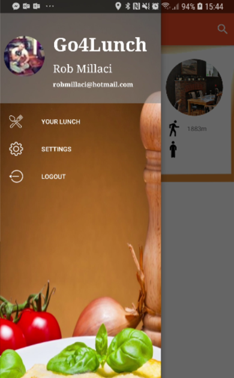
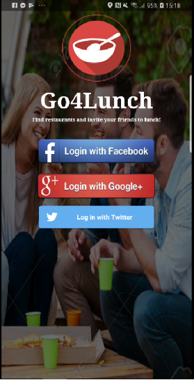
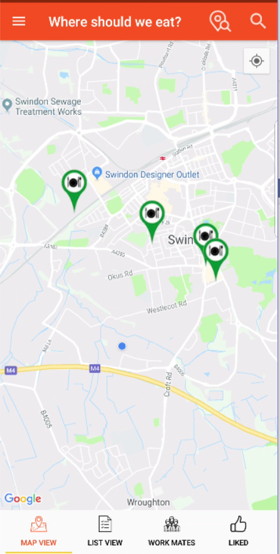
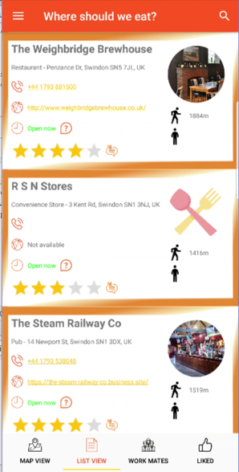
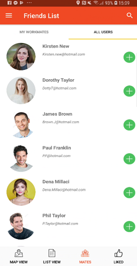
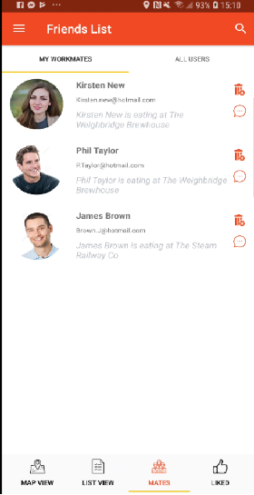
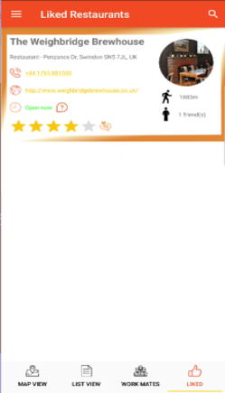
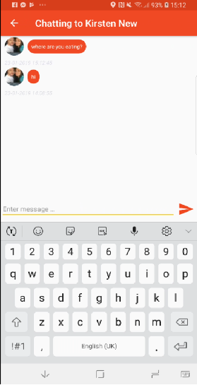
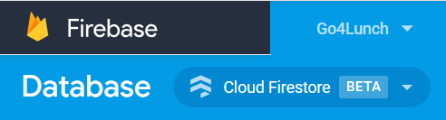

# Go4Lunch  
The Go4Lunch will be a collaborative application used by all employees. It will allow you to find restaurants near you and to share your restaurant choice with coworkers. You'll also be able to check out where your coworkers are headed for lunch and decide if you want to go with them. Just before the lunch break, the app will notify different employees and invite them to join their coworkers.

 
 
 

# Login via Facebook, Google or Twitter

# Locate nearby places to eat

# See local place details

# Find your friends within the app

# Add your friends to see details of their chosen places to eat
 

# Keep track of liked places
 

# Chat with friends to arrange meetups
 

# Uses Googles new Firebase firestore real time database

